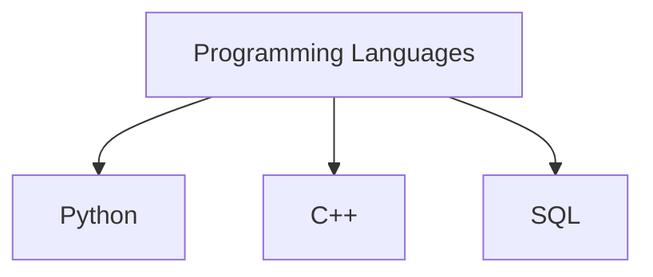
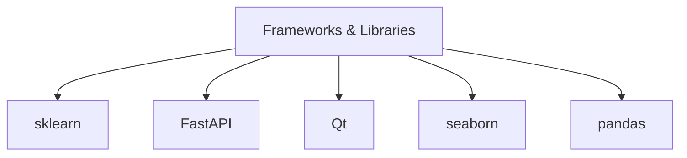
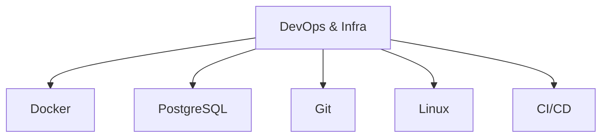

<h1 align="center">Hey there! I'm <a href="https://github.com/yourusername" target="_blank">Stepan</a> 👨‍💻</h1>
<h3 align="center">🎓 Engineering student @ Higher School of Economics · 🛠️ System Thinker · 📊 Data Explorer</h3>

<p align="center">
  
</p>

---

## 👾 About Me

```yaml
name: Stepan Boleznov
status: 3rd year BSc student
school: Higher School of Economics (HSE)
track: Information Science and Computation Technology
interests:
  - Data Engineering & Analytics
  - Full-Stack Development
  - Human-in-the-loop systems
  - Automation & Simulation
````

🔍 I love solving real-world problems through code — from automating boring stuff to building smart tools.
🧰 Whether it's a GUI app, backend API, or data pipeline — I enjoy designing systems that just work.
🚀 Passionate about open source, sports tech, and making code readable and reliable.
🛠 Currently working on projects where data meets infrastructure and interface.

---

## 🔧 My Toolbox








---

## 🚀 Featured Projects

| 📌 Project  | 🔍 Description  | 🔧 Stack  |
| ----------------------------- | -------------------------------------------------------------------------------- | ------------------------------------------- |
| **📦 Equipment Tracker App** | Desktop app for managing equipment issuance with GUI + backend API | `Python`, `PyQt`, `FastAPI`, `PostgreSQL` |
| **🏃‍♂️ Zwift Open Clone**    | Desktop cycling simulator with live data from bike trainer & heart rate sensors | `Python`, `Qt`, `Bluetooth`, `pyqtgraph`    |
| **🗳️ Market Analytics** | Service for comparing prices from diffent sites                                  | `Python`, `Playwright`, `pandas`|
| **📊 Competition results analyzer**  | Interactive animated visualizations to analyze and display dynamic performance data from a sports orienteering competition.  | `Python`, `Playwright`, `pandas`, `plotly`|


---

## 📫 Let's Connect!

[](https://t.me/sboleznov)
[](mailto:stepa0725@yandex.ru)

---

<p align="center">
  
</p>

<p align="center"><i>“Build like an engineer, think like a designer, test like a hacker.”</i></p>
```
